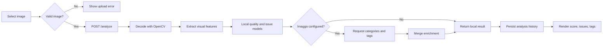
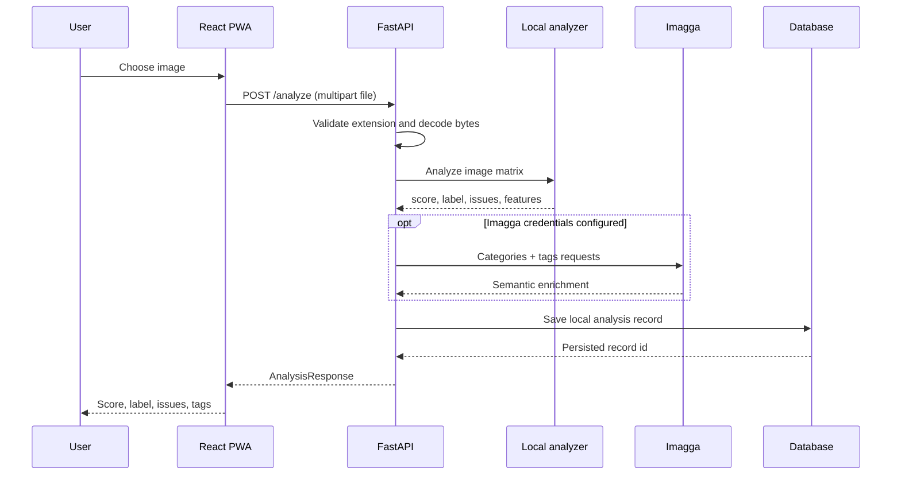
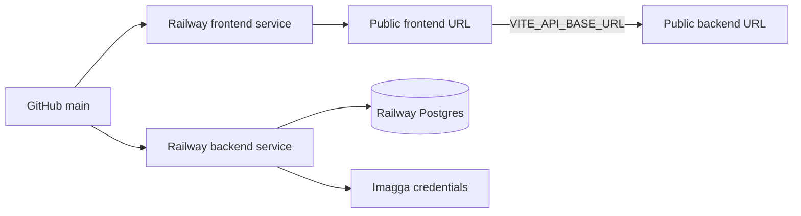

# Image Quality & Defect Detection

<div align="center">

### See the signal behind every image

An AI-assisted image inspection workspace that scores visual quality, detects likely defects, enriches results with Imagga tags and categories, and keeps an auditable analysis history.

[](backend/)
[](frontend/)
[](https://railway.app/)
[](frontend/public/manifest.webmanifest)

**Upload an image -> analyze it -> understand the score -> keep the result.**

</div>

---

## What It Does

| Capability | How it works |
| --- | --- |
| **Quality scoring** | Extracts 15 visual features such as blur, brightness, contrast, entropy, edge density, noise, and saturation. |
| **Defect detection** | Uses the available trained issue models, with a deterministic fallback when models are not present. |
| **Semantic enrichment** | Optionally calls Imagga categories and tags for object/context signals. |
| **History** | Persists filename, score, label, issues, features, and timestamp through SQLAlchemy. |
| **Mobile install** | Ships as a Progressive Web App with an install prompt, manifest, icon, and offline shell. |
| **Production containers** | Frontend and backend each have a Dockerfile and Railway deployment descriptor. |

## Product Flow



## System Architecture

```mermaid
flowchart TB
    User((User)) --> Browser[React PWA<br/>Vite + Axios]
    Browser -->|HTTPS / JSON + multipart| API[FastAPI service]
    Browser -.->|GET /api/* through nginx| Proxy[Nginx reverse proxy]
    Proxy --> API
    API --> CV[OpenCV + NumPy<br/>feature extraction]
    API --> ML[Joblib models<br/>quality + issue prediction]
    API --> DB[(SQL database<br/>SQLite local / Postgres production)]
    API --> Imagga[Imagga API<br/>categories + tags]
    API --> Health[/health]

    subgraph Railway
      API
      DB
      Proxy
    end
```

### Responsibilities

| Layer | Responsibility | Main files |
| --- | --- | --- |
| **Presentation** | Mobile-first scanner UI, install prompt, result state, history summary | `frontend/src/App.jsx`, `frontend/src/styles.css` |
| **PWA shell** | Install metadata, icon, offline fallback | `frontend/public/`, `frontend/src/main.jsx` |
| **HTTP API** | Validation, upload handling, response contracts, CORS | `backend/app/main.py`, `backend/app/schemas.py` |
| **Computer vision** | Extract image-quality features | `backend/app/features.py` |
| **Prediction** | Load trained models and produce score/issues | `backend/app/models.py`, `backend/model/` |
| **Enrichment** | Optional external semantic tags/categories | `backend/app/imagga.py` |
| **Persistence** | Store and retrieve analysis history | `backend/app/database.py` |

## Request Sequence



## Repository Map

```text
.
├── backend/
│   ├── app/
│   │   ├── database.py       # SQLAlchemy engine and history model
│   │   ├── features.py       # OpenCV / NumPy feature extraction
│   │   ├── imagga.py         # Optional Imagga client
│   │   ├── main.py           # FastAPI routes and orchestration
│   │   ├── models.py         # Quality and issue inference
│   │   └── schemas.py        # API response models
│   ├── model/                # Trained model artifacts
│   ├── Dockerfile
│   ├── railway.toml
│   └── requirements.txt
├── frontend/
│   ├── public/               # PWA manifest, service worker, app icon
│   ├── src/                  # React application and visual system
│   ├── Dockerfile
│   ├── nginx.conf
│   └── railway.toml
├── docker-compose.yml
└── README.md
```

## API Contract

### `GET /health`

Used by Docker and Railway to determine whether the API is ready.

```json
{ "status": "ok" }
```

### `POST /analyze`

Send a multipart form field named `file`. Supported extensions: `png`, `jpg`, `jpeg`, `bmp`, `tiff`.

```bash
curl -X POST http://localhost:8000/analyze \
  -F "file=@sample.jpg"
```

Response fields include:

```json
{
  "quality_score": 75,
  "quality_label": "ACCEPTABLE",
  "issues": [
    { "type": "none", "severity": "low", "confidence": 0.5 }
  ],
  "features": { "brightness_mean": 128.4, "edge_density": 0.08 },
  "model_status": "trained",
  "imagga_status": "available",
  "categories": [],
  "tags": []
}
```

`imagga_status` is `disabled` when credentials are absent and `error` when the provider is unavailable. Local scoring remains available in both cases.

### `GET /history`

Returns the newest saved analyses first.

### `GET /history/{id}`

Returns one saved analysis or `404` when the record does not exist.

## Run Locally

### Option A: Docker Compose

```bash
docker compose up --build
```

Open:

- Frontend: `http://localhost:3000`
- Backend docs: `http://localhost:8000/docs`
- Health: `http://localhost:8000/health`

### Option B: Development servers

Backend:

```bash
cd backend
python -m venv .venv
source .venv/bin/activate
pip install -r requirements.txt
uvicorn app.main:app --reload --port 8000
```

Frontend:

```bash
cd frontend
npm install
npm run dev -- --host 0.0.0.0
```

The Vite app defaults to `http://localhost:8000` in development. Override it with `VITE_API_BASE_URL` when needed.

## Configuration

Copy `backend/.env.example` into a local environment and fill values there. Never put secrets in frontend variables, Git, or the PWA bundle.

| Variable | Service | Purpose |
| --- | --- | --- |
| `DATABASE_URL` | Backend | SQLAlchemy database URL. Use SQLite locally and managed Postgres in production. |
| `IMAGGA_API_KEY` | Backend | Imagga credential, server-side only. |
| `IMAGGA_API_SECRET` | Backend | Imagga credential, server-side only. |
| `IMAGGA_API_URL` | Backend | Imagga base URL. Defaults to `https://api.imagga.com`. |
| `IMAGGA_CATEGORY_URL` | Backend | Category endpoint override. |
| `IMAGGA_TAGS_URL` | Backend | Tag endpoint override. |
| `ALLOWED_ORIGINS` | Backend | Comma-separated production frontend origins. |
| `VITE_API_BASE_URL` | Frontend build | Public backend URL embedded during the frontend build. |

## Railway Deployment

Deploy the repository as **two services** in one Railway project:



### Backend service

1. Create a Railway service from this GitHub repository.
2. Set the root directory to `backend`.
3. Select Dockerfile deployment. `backend/railway.toml` is already included.
4. Add `DATABASE_URL`, `IMAGGA_API_KEY`, `IMAGGA_API_SECRET`, and `ALLOWED_ORIGINS`.
5. Attach Railway Postgres and use its generated `DATABASE_URL`.
6. Confirm the service health check is `/health`.

### Frontend service

1. Create a second Railway service from the same repository.
2. Set the root directory to `frontend`.
3. Add build variable `VITE_API_BASE_URL=https://<backend-domain>`.
4. Select Dockerfile deployment. `frontend/railway.toml` is already included.
5. Generate a public domain and add that exact origin to backend `ALLOWED_ORIGINS`.

### Production checklist

- [ ] Rotate any credentials that were ever pasted into chat or committed locally.
- [ ] Use managed Postgres instead of SQLite for multi-instance production.
- [ ] Set `ALLOWED_ORIGINS` to the real frontend origin, not `*`.
- [ ] Confirm the backend `/health` check is green.
- [ ] Upload a test image and verify `/analyze`, `/history`, and Imagga enrichment.
- [ ] Confirm the frontend install prompt works over HTTPS.
- [ ] Add rate limiting and upload-size limits before opening the API broadly.

## Security Notes

- Imagga credentials are read only by the backend process.
- The frontend never receives or stores the Imagga secret.
- CORS is configurable per deployment; the development default is permissive for local testing.
- Uploaded files are decoded in memory and are not written to disk by the API.
- A production hardening pass should add authentication, request throttling, file-size limits, structured logging, and retention controls.

## Milestones

### Complete

- [x] Mobile-first React interface
- [x] FastAPI image analysis API
- [x] Local feature extraction and model fallback
- [x] Persistent analysis history
- [x] Imagga categories and tags integration
- [x] PWA installable shell
- [x] Docker and Railway deployment descriptors

### Next

- [ ] Add an analysis detail page with feature charts and issue confidence bars
- [ ] Add authenticated workspaces and per-user history
- [ ] Add upload size limits, rate limiting, and request IDs
- [ ] Add automated backend tests for valid, invalid, empty, and corrupt uploads
- [ ] Add Postgres migrations and retention policies
- [ ] Add observability with health, latency, provider error, and model metrics

## License

No license has been declared yet. Add one before distributing the project publicly.
